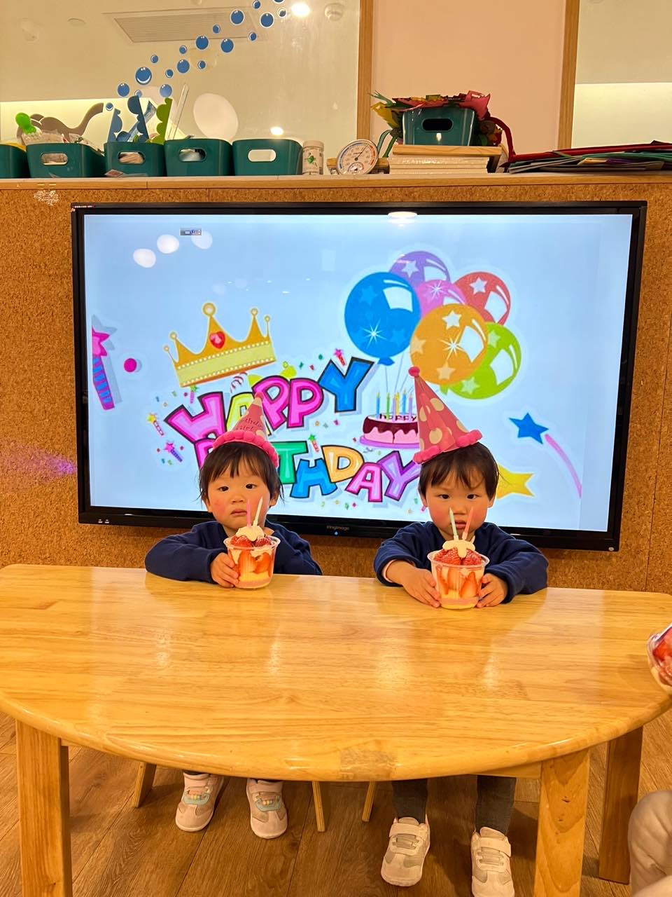
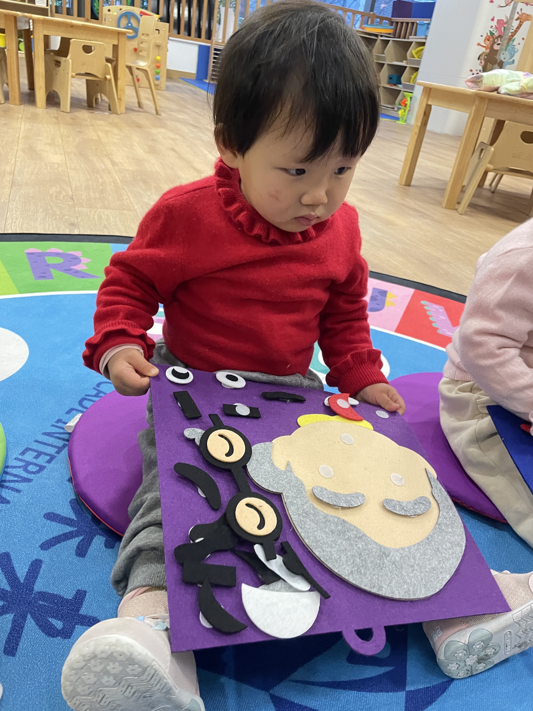
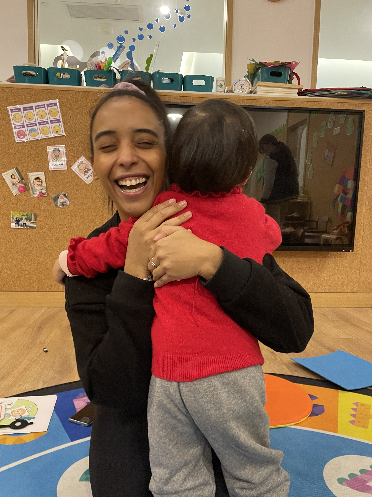
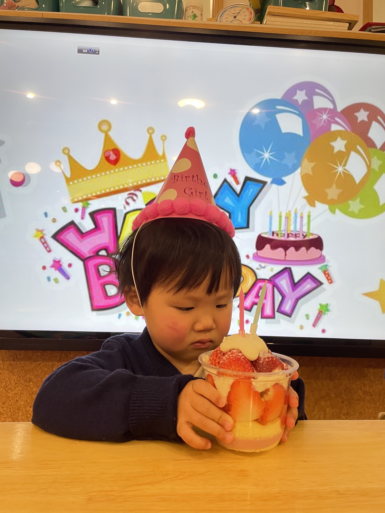
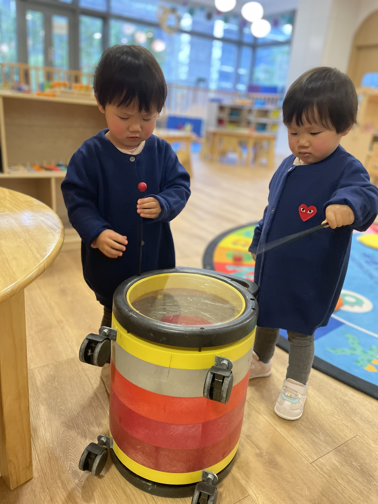
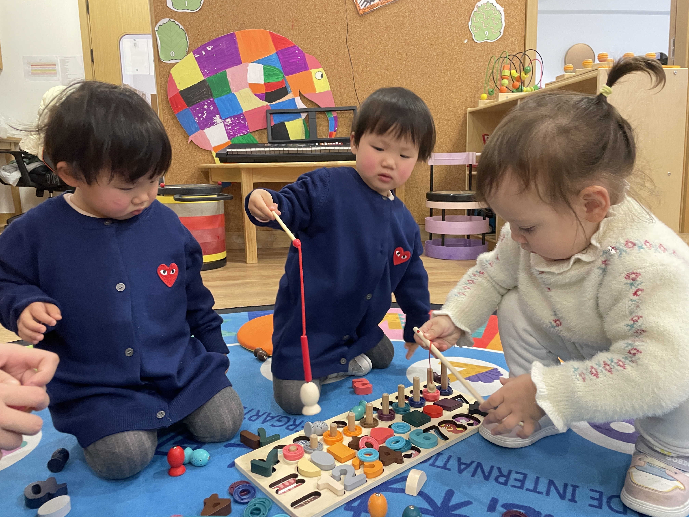
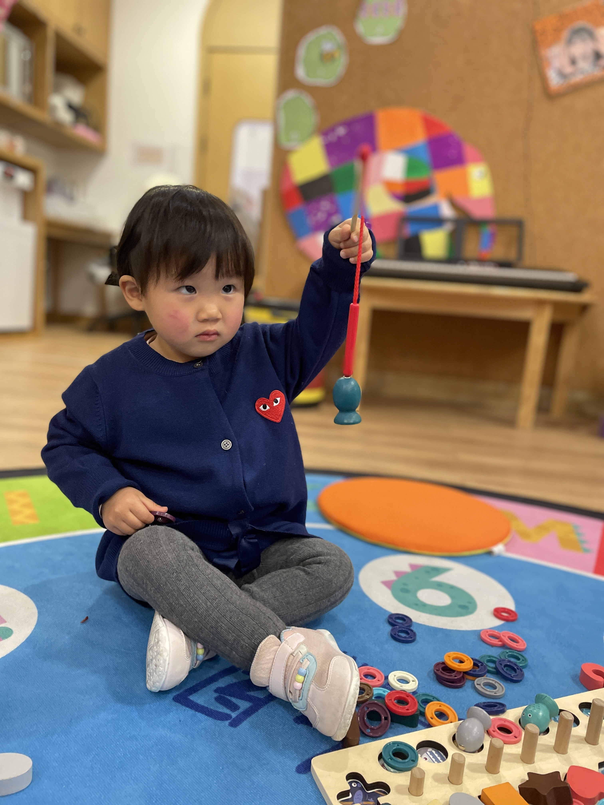
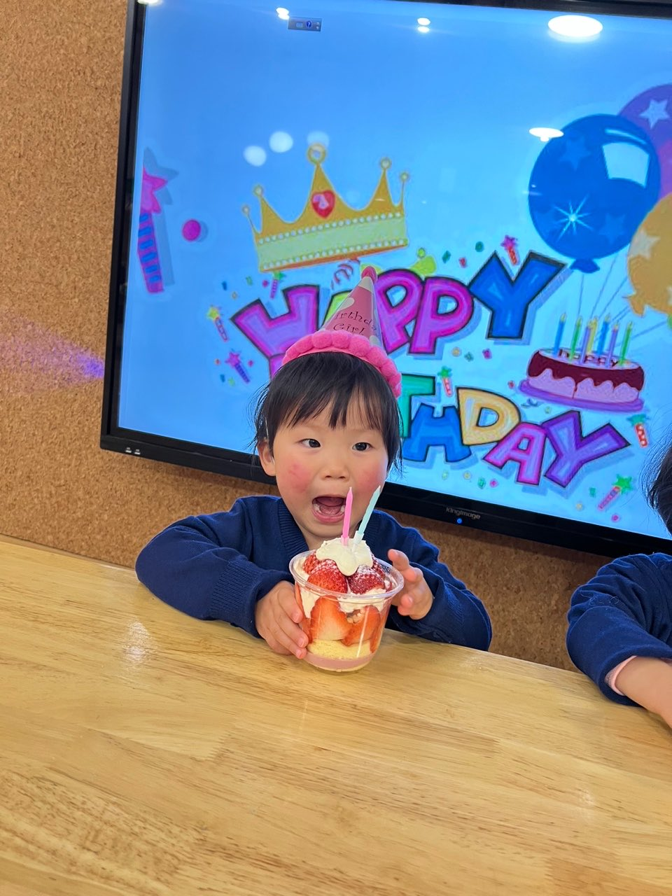

👶我是珊瑚，看看我今天的表现哦~🌻

1⃣️生活习惯👇
- 【1】今天的餐食基本上全部都吃完啦😋早餐还有中午的米饭、牛肉和莲藕，蔬菜也吃了一点。上午的水果、下午的点心也全部吃掉啦😊
- 【2】我喝了一壶水，听老师的话，要多喝水哦！💦
- 【3】我换了三次尿不湿，没有拉臭臭呢😇
- 【4】我玩累了，中午睡了一会儿😴
- 【5】🌡️我的体温是正常的哦👍

2⃣️今天我们学了音乐和英语呢！🎶

在音乐活动中，我们学了《如果感到幸福你就拍拍手》这首儿歌，大家跟着音乐表达不同的情绪，像跺脚、拍手这些动作。感觉珊瑚很喜欢音乐活动呢🎵

3⃣️今天的表现👇

老师说我今天勇敢地上台表演啦！虽然我刚刚上幼儿园三个星期呢，但是我只要一起唱歌跳舞，就好像快乐高一样😁而且还很幸福地度过了我的第一个生日呢🎂

> #珊瑚 #宝宝一日情况记录 #生活习惯 #饮食 #喝水 #如厕 #午睡 #课程 #音乐活动 #英语活动 #一日表现 #勇敢 #生日快乐 #提示 #室内鞋