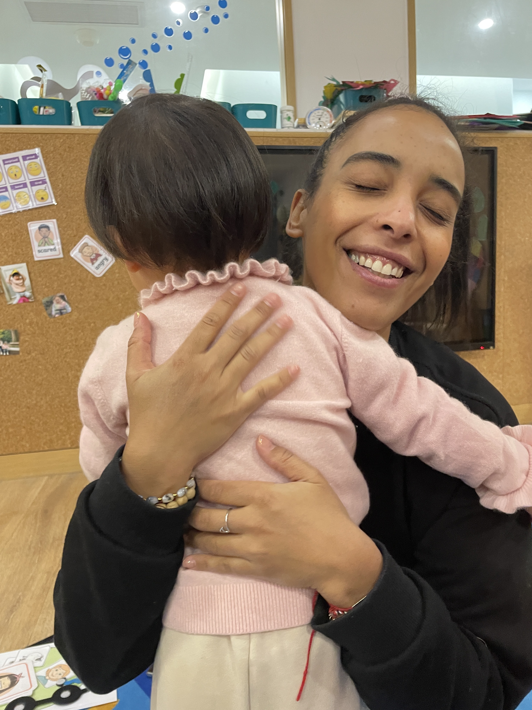
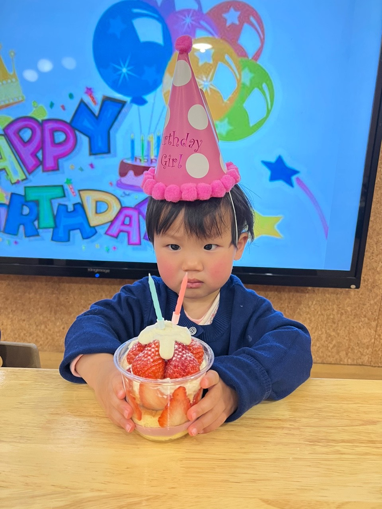

👶🏻我是海兔，今天我的日常如下👇

1️⃣ 生活习惯👇
- 🍴用餐情况：早餐吃光光🥟🍳🍊，点心吃光光🍎🍊🧁，午餐吃光光🍙🥩🥢，下午点心吃光光🥣🧁🍎
- 💧喝水情况：我今天可以自己喝水啦，喝了一大半壶。💦
- 🚽如厕情况：今天换了尿布，没有拉臭臭。💩
- 💤午睡情况：我今天有午睡，睡着啦。😴
- 🌞体温情况：正常

2️⃣ 课程内容👇

🎶音乐活动：今天我们学了一首叫《如果感到幸福你就拍拍手》的歌，用手拍和脚跺来表达自己的情感，好有趣呢！👏🏻🦶🏻

3️⃣ 一日表现👇

👩‍🏫今天是快乐的周五，我们和Hannah老师一起学习音乐活动，还玩了表情玩具，一起记住happy和sad这两个单词。

我还和珊瑚姐姐、Harper一起在彩虹布上玩耍，玩了好几种玩法，很开心呢！👩🏻‍🏫老师还给珊瑚和我过了生日，吃了美味的蛋糕🎂

最让我开心的是今天我第一次登上舞台，没有紧张，还和老师一起表演节目呢！ 期待下次的表演，多给大家带来惊喜和变化哦💕！

> #海兔日常 #健康状态 #好习惯养成 #美食记录 #音乐活动 #舞台表演 #珊瑚海兔两周岁生日 #快乐周五 #彩虹布游戏 #表情玩具 #开心