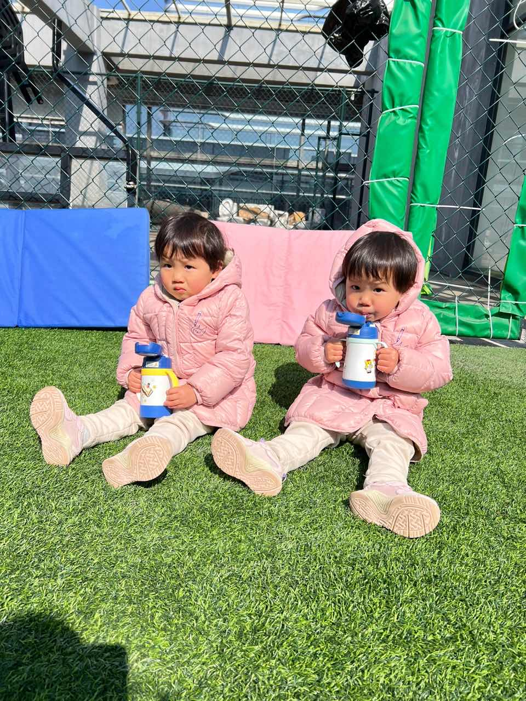
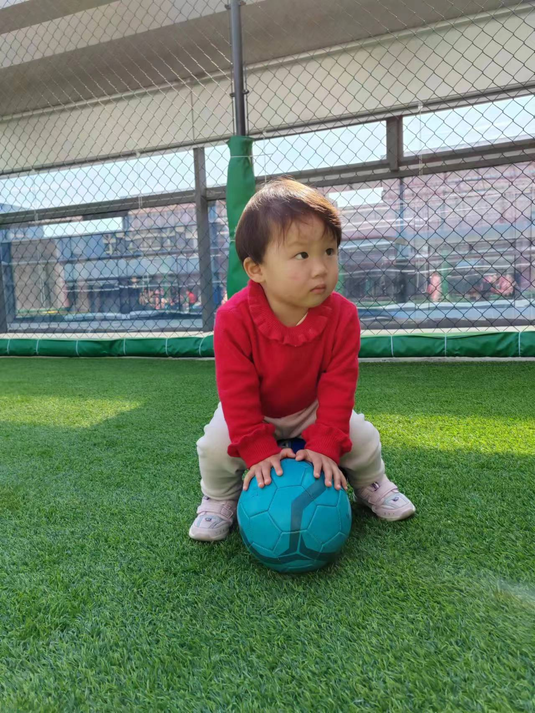
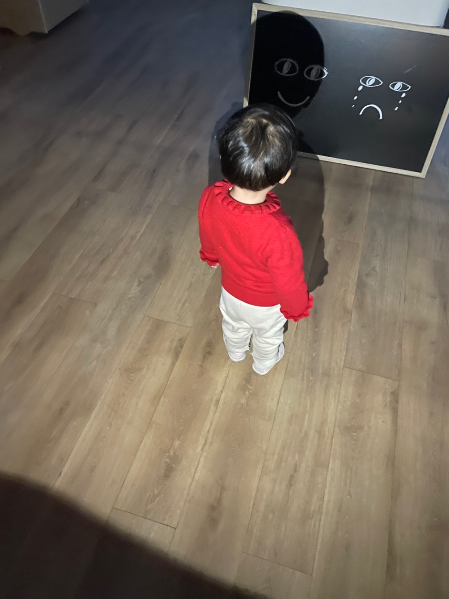
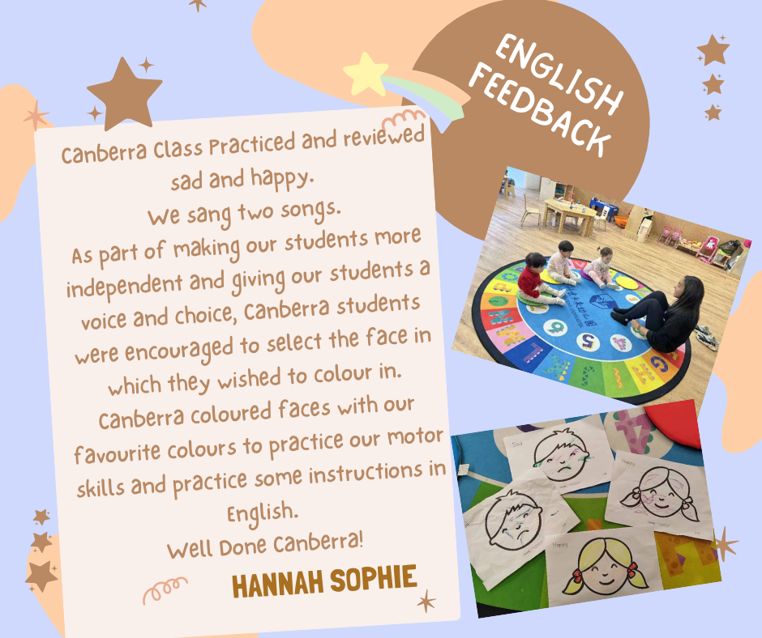
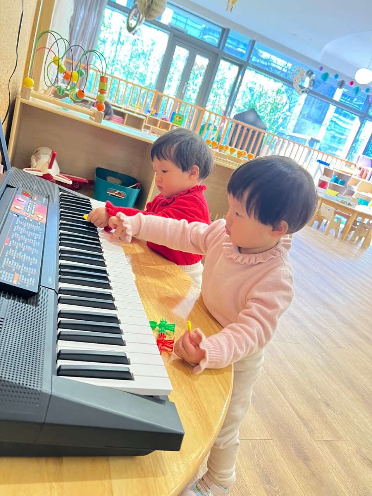
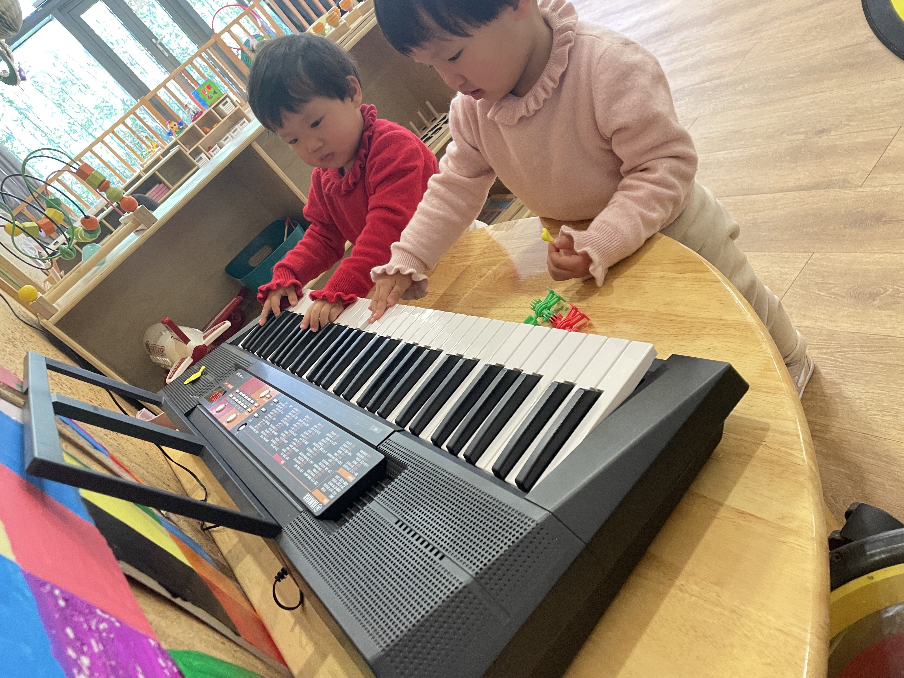
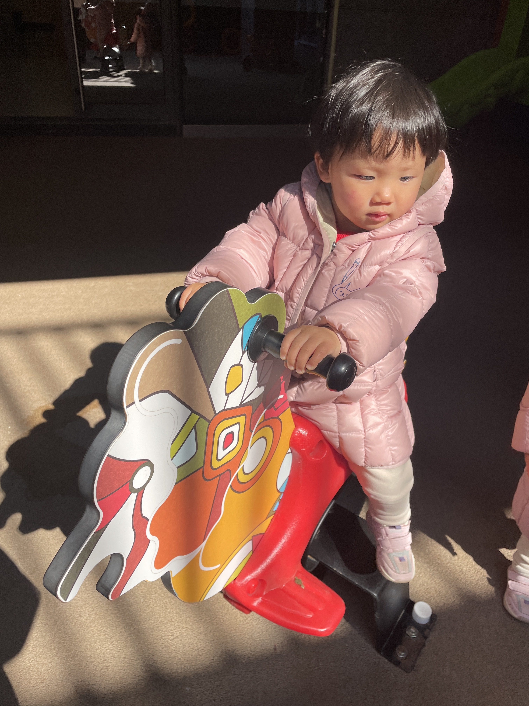
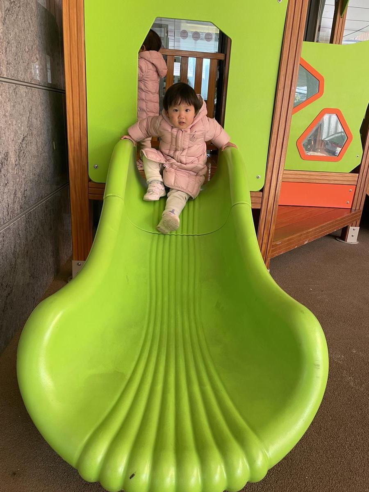
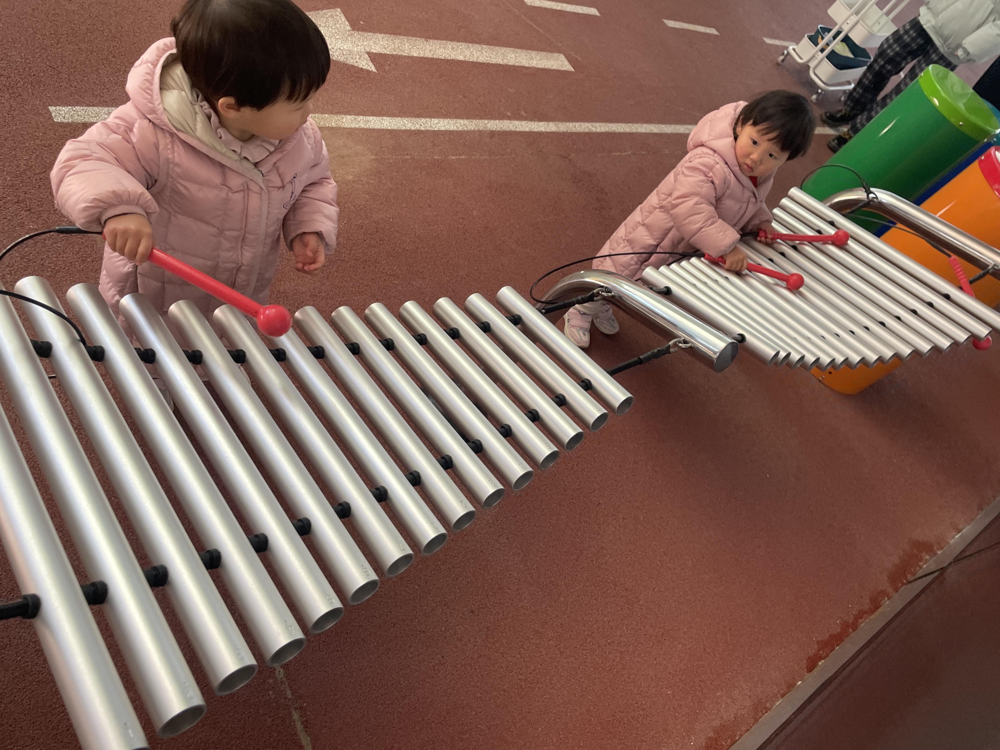
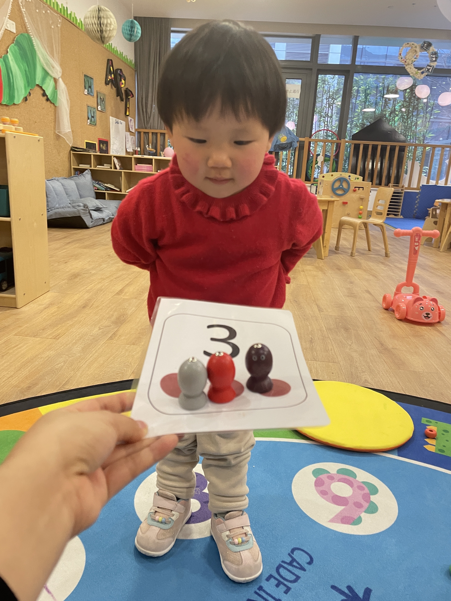

👼🏻我是珊瑚 🌻看看我今天的表现🌻

1⃣️ 我的生活习惯👇
- 【1】用餐情况：今天早餐我吃了包子的一半，馅儿吃完了，鸡蛋也吃完了，小番茄不太喜欢，没吃；点心时间我喝了酸奶，橘子和小番茄也吃完了，不过甜瓜没吃完；午饭是面条，我把面条都吃完了，肉肉吃了一点点，蔬菜吃了几口。
- 【2】喝水情况：有时候我会主动喝水，我今天还帮海兔拿了水壶，喝了大半壶的水😝
- 【3】如厕情况：我今天没有在马桶上尿尿，也没有拉臭臭，换了新的尿不湿。
- 【4】午睡情况：我睡得很香💤
- 【5】体温情况：上午和下午都是正常的😃

- 2⃣️ 今天的课程内容👇
- 《体育课》

今天的体育课很有趣，我们用标记桶、标记盘、橡胶圈等器械进行游戏，找相同颜色，还可以增强我手指的灵活性，并且进行手眼协调的训练。这样可以帮我们提高反应能力。

- 《影子表情游戏》

我们今天玩了光影游戏，感受到神奇的光影，还可以练习区分happy和sad😊😢
在游戏中，我们还学习了听指令进行向前走、向后退的动作，准确地将影子投射在表情图上，从而形成有表情的影子。

3⃣️ 我的一日表现👇

今天星期一，我们已经开学很久了，但是今天是我是第一次参与升旗仪式！虽然我还很小，但是我对待升旗仪式非常认真。当音乐响起的时候，我一直盯着五星红旗缓缓升起，然后一直保持着注目礼的姿势！

在圆圈时间，我可以自己坐下来，和Hannah老师互动，不需要别人的陪同。我还可以根据Hannah老师的要求，把Happy和Sad正确地摆放，一起唱歌，氛围越来越好，我的动作也越来越多啦！

在室内游戏时间，我还和海兔妹妹一起弹钢琴，在户外时间，我也会敲敲鼓，敲敲琴，看来我真的很喜欢音乐，不同的好听的声音让我很开心！

在体育课上，我变得更加活泼了，我可以自己找颜色，找朋友，分类也很准确，并且我的技能满分哦。我还能跟Hannah老师一起踢足球并射门，我的运动水平也很棒哦！

我现在越来越熟悉老师们了，有时候我也会有一些小调皮的动作，比如吃点心时又唱歌又跳舞😜哈哈，老师已经和我们聊过这个问题了，在家里爸爸妈妈要提醒我，吃饭的时候不能做蹦跳、喊叫等危险的动作，而且也要注意文明的餐桌礼仪。我们要从小培养好的习惯呢！

> #珊瑚的一日情况记录 #生活习惯 #我的一日表现 #温馨提示
